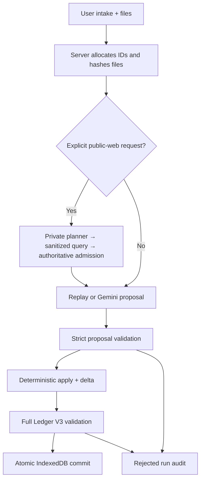

# Runtime architecture

Ledger V3 is the sole authoritative case state. Gemini can propose typed operations, but it cannot allocate canonical IDs, delete records, author a full replacement snapshot, or commit browser state.

## Acceptance rules

- Every accepted intake creates one linear revision with a single parent.
- Every introduced source has an explicit relationship disposition.
- Every evidence item has an inspection in the current revision.
- A user-submitted evidence inspection is proposal-authored; an admitted web-evidence inspection is server-owned.
- Google Search never receives the raw case. It receives only a validated public query and authority target.
- A web result is not canonical evidence until its grounded direct URL, source class, and claim-specific authority pass server admission.
- A failed or non-authoritative retrieval cannot close a Gap or be replaced by model memory.
- Claim source categories equal the effective accepted relationships.
- Gap and action lifecycle changes are explicit transitions with source basis.
- Revision delta order, counts, operations, reasons, and source IDs are validated deterministically.
- A response is committed only after the complete candidate ledger validates.
- React canonical state changes only after the IndexedDB transaction completes.
- Rejected and provider-error responses contain an audit record and no replacement ledger.

## Main modules

| Area | Files |
| --- | --- |
| Ledger contract | `src/ledger/types.ts`, `src/ledger/schema.ts` |
| Proposal contract | `src/provider/proposalSchema.ts` |
| Deterministic application | `src/ledger/applyProposal.ts` |
| Server boundary | `server/intakeService.ts`, `server/proposalProvider.ts` |
| Authoritative retrieval | `server/authoritativeRetrieval.ts`, `src/retrieval/types.ts` |
| Local persistence | `src/storage/ledgerStore.ts` |
| UI projection | `src/presentation/projectLedger.ts` |

## Inference modes

Replay is a deterministic, credential-free product demo. It records user reports conservatively, inspects file metadata without inventing document contents, and supports an explicit `[reject]` input for commit-boundary demonstrations.

Live mode uses the server-held `GEMINI_API_KEY` and exactly `gemini-3.6-flash`. Source material is treated as untrusted data. Explicit authoritative retrieval uses a no-search planning call, a public-query-only Google Search call, and then a no-search proposal call. The provider returns an operation proposal constrained by JSON Schema; application code remains the only path to an accepted revision.

See [AUTHORITATIVE_RETRIEVAL.md](AUTHORITATIVE_RETRIEVAL.md) for the source and privacy decision contract.
