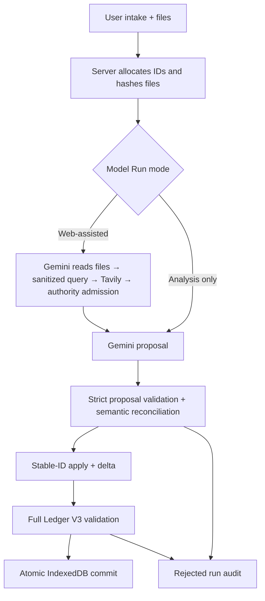

# Runtime architecture

Ledger V3 is the sole authoritative case state. Gemini can propose typed operations, but it cannot allocate canonical IDs, delete records, author a full replacement snapshot, or commit browser state.

## Acceptance rules

- Every accepted intake creates one linear revision with a single parent.
- Every introduced source has an explicit relationship disposition.
- Every evidence item has an inspection in the current revision.
- A user-submitted evidence inspection is proposal-authored; an admitted web-evidence inspection is server-owned.
- Tavily Search never receives the raw case. It receives only a validated public query and official-domain filters.
- A web result is not canonical evidence until its provider-returned direct URL, planned domain, source class, and claim-specific authority pass server admission.
- A failed or non-authoritative retrieval cannot close a Gap or be replaced by model memory.
- Claim source categories equal the effective accepted relationships.
- Gap and action lifecycle changes are explicit transitions with source basis.
- Corrections keep stable Event, Claim, Gap, and Action IDs. The prior revision remains unchanged; the child revision carries a sourced `update` delta.
- Ambiguous correction targets fail closed instead of allocating a duplicate entity.
- Complex answers store ordered Fact, Public Rule, Assumption, Derivation, Scenario, and Conclusion steps. Derived steps must reference earlier step IDs; facts/rules/gaps retain their canonical source links.
- Revision delta order, counts, operations, reasons, and source IDs are validated deterministically.
- A response is committed only after the complete candidate ledger validates.
- React canonical state changes only after the IndexedDB transaction completes.
- Rejected and provider-error responses contain an audit record and no replacement ledger.

## Main modules

| Area | Files |
| --- | --- |
| Ledger contract | `src/ledger/types.ts`, `src/ledger/schema.ts` |
| Proposal contract | `src/provider/proposalSchema.ts`, `src/provider/reconcileProposal.ts` |
| Deterministic application | `src/ledger/applyProposal.ts` |
| Server boundary | `server/intakeService.ts`, `server/proposalProvider.ts` |
| Authoritative retrieval | `server/authoritativeRetrieval.ts`, `src/retrieval/types.ts` |
| Local persistence | `src/storage/ledgerStore.ts` |
| UI projection | `src/presentation/projectLedger.ts` |

## Inference and Model Run modes

Replay is a deterministic, credential-free product demo. It records user reports conservatively, inspects file metadata without inventing document contents, and supports an explicit `[reject]` input for commit-boundary demonstrations.

Live analysis uses the server-held `GEMINI_API_KEY` and exactly `gemini-3.6-flash`. Source material is treated as untrusted data. The user selects one of two product modes:

- **Analysis only:** Gemini analyzes the supplied statement and artifacts; no public-web provider is called.
- **Web-assisted:** Gemini first reads the supplied statement and inline PDF/image artifacts, plans only remaining public needs, and emits a sanitized query plus official domains. Tavily Search receives only that reduced request. Admitted `[E]` excerpts are then available to Gemini's final proposal.

Tavily does not replace Gemini and never receives the raw case. The provider returns an operation proposal constrained by JSON Schema; application code reconciles semantic identity, allocates canonical IDs, validates the complete candidate revision, and remains the only path to acceptance.

See [AUTHORITATIVE_RETRIEVAL.md](AUTHORITATIVE_RETRIEVAL.md) for the source and privacy decision contract.
